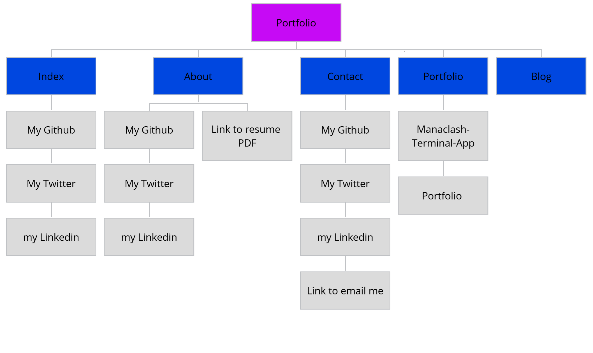
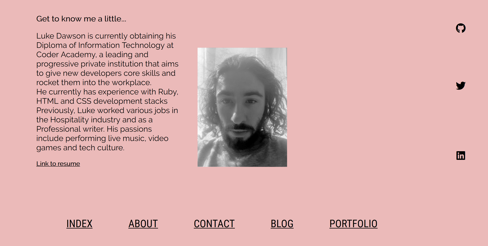
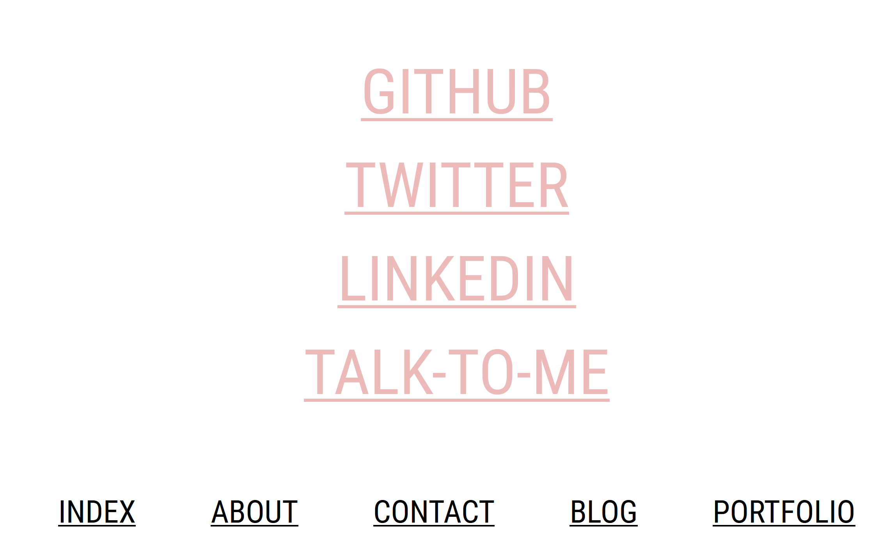
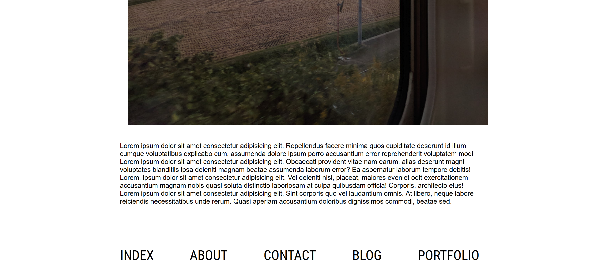
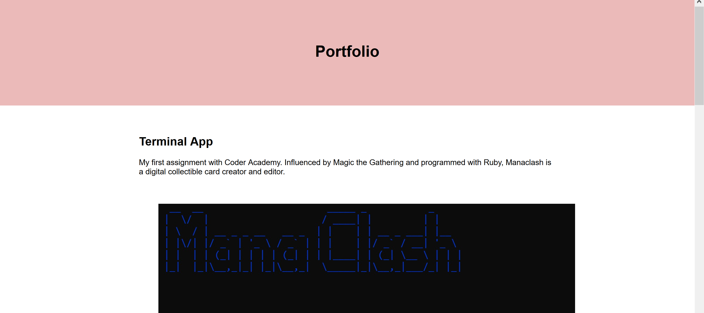
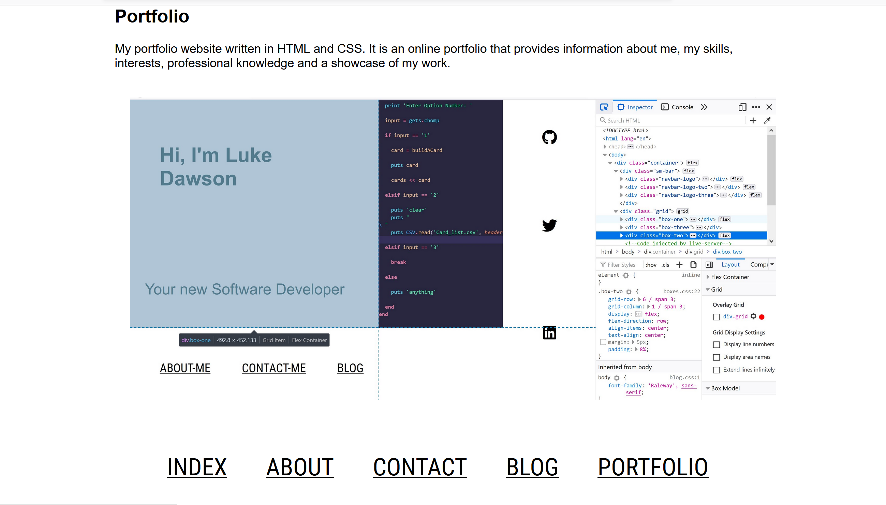

  # Portfolio Assignment T1A3
### by Luke Dawson 
Repo link: https://github.com/Apochilles/Portfolio-T1A3

published portfolio website: https://modest-bose-9e8e7a.netlify.com

##  Description of my portfolio website:

technical knowledge relating to information technology, software development/coding, programming languages and development stacks
    high expectations of professionalism, collaboration and a positive work ethic

        
   

    
## Purpose

My portfolio website was created to give me a strong internet presence as a developer. In this age of social media it is incredibly important to keep up your presence on social media so to have a hub and a collection of your work and personality is very important. 
 ### Functionality / features
 My website operates on a simple system
 ###  Sitemap

 ### Screenshots

### Target audience
The target audience for the portfolio website is an employer looking to engage a dev and/or IT professional. Expect the employer to have the following knowledge and expectations:

### Tech stack (e.g. html, css, deployment platform, etc)
