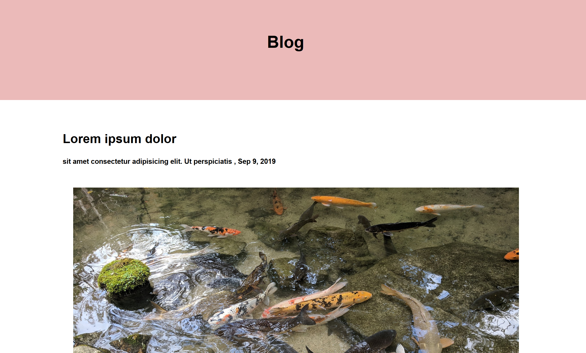

  # Portfolio Assignment T1A3
### by Luke Dawson 
Repo link: https://github.com/Apochilles/Portfolio-T1A3

published portfolio website: https://modest-bose-9e8e7a.netlify.com

##  Description of my portfolio website:
My portfolio website is an online hub that shows off my personality and professional achievements thus far. 
  
## Purpose
My portfolio website was created to give me a strong internet presence as a developer. In this age of social media it is incredibly important to keep up your online so to have a hub containin your work and personality is extremely important. 
 ### Functionality / features
 My website operates on a clean and simple display. I have a social media navbar and a footer that is repeated throughout my webpage for consistant ... I also have short and stabby paragraphs that and links to my other work up to this point.  
 ###  Sitemap

 ### Screenshots

### Target audience
My target audience is my future employers looking to hire junior developers and contenpories who might want to get a sense of who I am and maybe collaborate with me. 

### Tech stack (e.g. html, css, deployment platform, etc)

My website is written in HTML and CSS. It is contiuous deployed by Netlify. 
